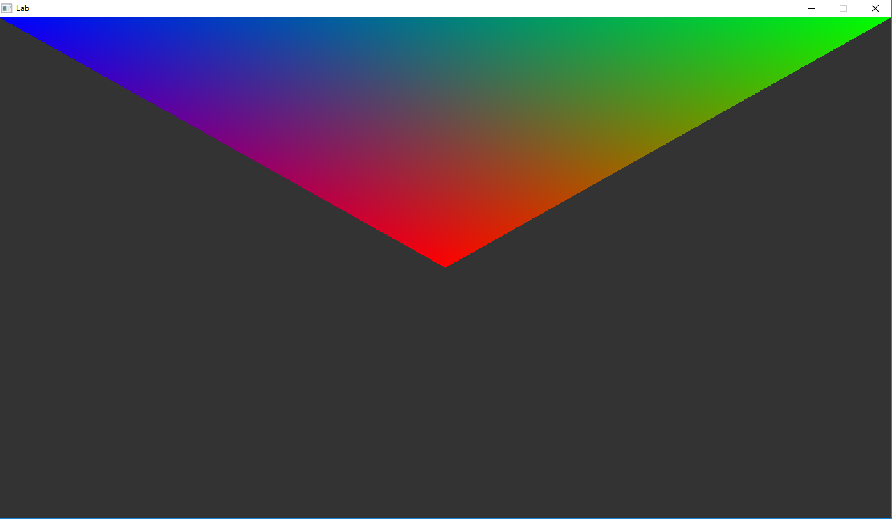

# Part 1 - Color



> "Adding color into the world!"

# Logistics

- You may use whatever operating system, IDE, or tools for completing this lab/assignment.
	- However, my instructions will usually be using the command-line, and that is what I will most easily be able to assist you with.
- In the future there may be restrictions, so please review the logistics each time.

**For this Lab/Assignment**: You will be working on your own laptop/desktop machine. Historically, the setup is the most difficult part of the assignment, because supporting multiple architectures and operating systems can be tricky. Nevertheless, we will get through it!
# Resources to Help

Some additional resources to help you through this lab assignment

| SDL2 related links                                    | Description                       |
| --------------------------------------------------    | --------------------------------- |
| [SDL API Wiki](https://wiki.libsdl.org/APIByCategory) | Useful guide to all things SDL2   |
| [My SDL2 Youtube Playlist](https://www.youtube.com/playlist?list=PLvv0ScY6vfd-p1gSnbQhY7vMe2rng0IL0) | My Guide for using SDL2 in video form.   |
| [Lazy Foo](http://lazyfoo.net/tutorials/SDL/)         | Great page with written tutorials for learning SDL2. Helpful setup tutorials for each platform. |
| [Lazy Foo - Handling Key Presses](https://lazyfoo.net/tutorials/SDL/04_key_presses/index.php) | Useful tutorial for learning how to handle key presses | 

| OpenGL related links                                | Description                       |
| --------------------------------------------------  | --------------------------------- |
| [My OpenGL Youtube Series](https://www.youtube.com/playlist?list=PLvv0ScY6vfd9zlZkIIqGDeG5TUWswkMox) | My video series for learning OpenGL |
| [docs.gl](http://docs.gl)                           | Excellent documentation to search for OpenGL commands with examples and description of function parameters   |
| [learnopengl.com](https://learnopengl.com)          | OpenGL 3.3+ related tutorial and main free written resource for the course   |


| C++ related links                                   | Description                       |
| --------------------------------------------------  | --------------------------------- |
| [My C++ Youtube Series](https://www.youtube.com/playlist?list=PLvv0ScY6vfd8j-tlhYVPYgiIyXduu6m-L) | My video series playlist for learning C++ |
| [cppreference](https://en.cppreference.com/w/)      | Definitive, more encyclopedic guide to C++ (less beginner focused, but excellent technically) |
| [cplusplus.com](http://www.cplusplus.com)           | Nice website with examples and tutorials geared more for beginners, reference has lots of examples, and the tutorial page is a great starting point |
| [learncpp.com](https://www.learncpp.com/)           | Handy page for learning C++ in tutorial form   |


# Description

Previously you have rendered a triangle and a square to the screen in OpenGL, as a recap:

1. We created an [index buffer](http://www.opengl-tutorial.org/intermediate-tutorials/tutorial-9-vbo-indexing/#indexed-vbo-in-opengl) as a more efficient way to render triangles.
	- This second buffer was populated with the indices that represented a vertex.
2. Then we used [glDrawElements](http://docs.gl/gl3/glDrawElements) to select which vertices to draw (either a portion of them, or all of them).
3. Also of importance, was that you used your own vertex shader and fragment shader.
	- These are tiny programs that execute on the GPU (one for the vertex processing stage, and another for the fragment shader stage)

Today we are going to work on the following task(s):

1. Adding multiple (3 in total) colors to our triangles (i.e. adding a vertex attribute to our triangle)

# Introduction

Today we are going to add color to our triangles. What this will demonstrate is how to add more attributes to our vertices (i.e. vertex attributes) to make them less boring. By adding more color, we'll have to learn how we can pack more information inside our buffers ultimately changing how our objects are rendered.

For our second task, we are going to incorporate what we previously learned about transformations to create a perspective view of our scene.

## Task 1 - Color and glVertexAttribPointer

You will find in the code "TODO" sections in the [./src/main.cpp](./src/main.cpp).

### The goal for this section is to render

1. A colored triangle.

In order to do this we need to store more information in our model. Currently we have 'positional' data that stores where the vertices exist. We can additionally add 'color' data as another three-tuple. That is, we need to add 'R, G, B' data to our verts.

So, each of your vertices should have a position, and a R,G,B value (e.g, `0.0f, 0.0f, 0.0f, 1.0f, 1.0f, 1.0f` This is a vertex at position 0,0,0 that is a white color 1.0, 1.0, 1.0)

The next thing to look at is how to 'point' to specific attributes. Our opengl shaders will need to know how to access the different attributes from within the same 'block' of data that we are sending over.

[glEnableVertexAttribArray](http://docs.gl/gl3/glEnableVertexAttribArray) and [glVertexAttribPointer](http://docs.gl/gl3/glVertexAttribPointer)

So for our attributes, we first need to enable a new attribute. Once we do that, then we need to tell how OpenGL should interpret that data. You might find this video helpful in your journey: https://www.youtube.com/watch?v=mtvaqJduE6c&list=PLvv0ScY6vfd9zlZkIIqGDeG5TUWswkMox&index=14

Note: For your second attribute, you will have to play with the 'stride' and 'offset' (or starting point) of the data.

### Vertex Buffer Object Attributes quick glance

```c
// Finally pass in our vertex data 
 glEnableVertexAttribArray(0);    

// Now setup the 'iterator' to the next piece of data.
// Observe for our positional data we now have a stride of '6'
 
         glVertexAttribPointer(  0,   // Attribute 0, which will match layout in shader
                                 3,   // size (Number of components (2=x,y)  (3=x,y,z), etc.) 
                          GL_FLOAT, // Type of data
                          GL_FALSE, // Is the data normalized
                          sizeof(float)*6, // Stride - Amount of bytes between each vertex.
                          // If we only have vertex data, then this is 0.             
                          // That means our vertices(or whatever data) is tightly packed, 
                          // one after the other.    
                          // If we add in vertex color information(3 more floats), 
                          // then this becomes 6, as we move 6*sizeof(float) 
                          // to get to the next chunk of data.                    
                          // If we have normals, then we need to 
                          // jump 3*sizeof(GL_FLOAT) bytes to get
                          // to our next vertex.
                          0       // Pointer to the starting point of our data. 
                                  // If we are just grabbing vertices, this is 0. 
                                  // But if we have some other attribute, 
                                  // (stored in the same data structure), 
                                  // this may vary if the very first element
                                  // is some different attribute. 
                                  // If we had some data after (say normals), then 
                                  // we would have an offset 
                                  // of 3*sizeof(GL_FLOAT) for example
                            );       
```

#### Example Stride

The figure below shows how data is positioned, and different attributes are stored. Again, these attribute pointers act as 'iterators' for accessing data per vertex in your vertex shader.


#### Note on Layout qualifiers

[Layout Qualifiers](https://www.khronos.org/opengl/wiki/Layout_Qualifier_(GLSL)) in GLSL tell our shaders 'where' the storage comes from. So think about the [glVertexAttribPointer](http://docs.gl/gl3/glVertexAttribPointer) that we previously setup--this is a pointer to a buffer of data. This 'pointer' that we have can 'hop around' (i.e. the stride would represent how far we hop (i.e., 6 floats if we have x,y,z,r,g,b data and the 'offset' we setup in glVertexAttribPointer would be the initial 'hop' so that we start at either our x,y,z data, or our r,g,b data)

### Vertex Shader quick glance

- **note:** The vertex shader provided in the shaders folder is *nearly* done for you, you will have to uncomment some blocks.
- **note:** The fragment shader has been done for you.

```glsl
  // ==================================================================
  #version 410 core

  layout(location=0)in vec3 position; // We explicitly state which is the vertex information (The first 3 floats are positional data, we are putting in our vector)
  layout(location=1)in vec3 vertexColors; // Our second attribute which is the color.

  // Do not forget this!
  out vec3 v_vertexColors;

  void main()
  {
    // gl_Position is a special glsl variable that tells us what
    // postiion to put things in.
    // It takes in exactly 4 things.
    // Note that 'w' (the 4th dimension) should be 1.
    gl_Position = vec4(position.x, position.y, position.z, 1.0f);

    // Store the vertex color that we take in as what we will output
    // to the next stage in the graphics pipeline.
    v_vertexColors = vertexColors;

  }
  // ==================================================================

```

### Fragment Shader Quick Glance

```glsl
  // ==================================================================
  #version 410 core
  out vec4 color;

  in vec3 v_vertexColors;

  void main()
  {
   // color is a vec4 representing color. Because we are in a fragment
   // shader, we are expecting in our pipeline a color output.
   // That is essentially the job of the fragment shader!
    color = vec4(v_vertexColors.r,v_vertexColors.g, v_vertexColors.b, 1.0f);
    
    // or alternatively
    // color = vec4(theColor, 1.0);
  }
  // ==================================================================
```

# Submission/Deliverables

### Submission

- Commit all of your files to github, including any additional files you create.
- Do not commit any binary files unless told to do so.
- Do not commit any 'data' files generated when executing a binary.

### Deliverables

1. A colored Triangle

# F.A.Q. (Instructor Anticipated Questions)

1. N/A

# Going Further

What is that, you finished early? Did you enjoy this lab? Here are some (optional) ways to further this assignment.

- Move your triangle with the arrow keys
- Try changing the colors of the triangle slowly over time.

# Found a bug?

If you found a mistake (big or small, including spelling mistakes) in this lab, kindly send me an e-mail. It is not seen as nitpicky, but appreciated! (Or rather, future generations of students will appreciate it!)

- Fun fact: The famous computer scientist Donald Knuth would pay folks one $2.56 for errors in his published works. [[source](https://en.wikipedia.org/wiki/Knuth_reward_check)]
- Unfortunately, there is no monetary reward in this course :)
