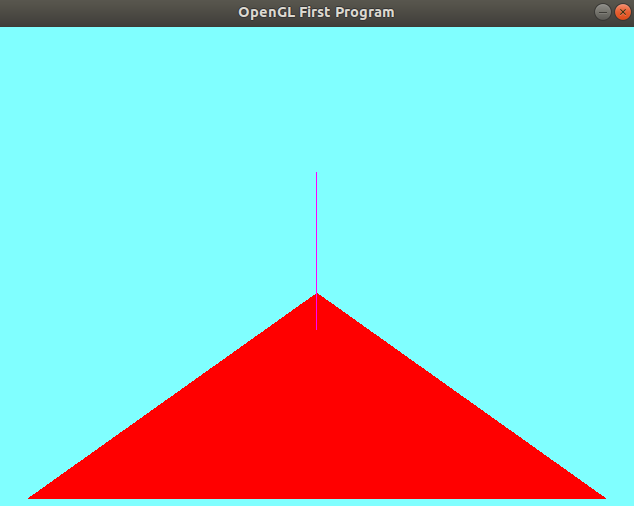

# Part 2 - Surface Normals


> "A vector perpendicular to a surface!"

# Logistics

- You may use whatever operating system, IDE, or tools for completing this lab/assignment.
	- However, my instructions will usually be using the command-line, and that is what I will most easily be able to assist you with.
- In the future there may be restrictions, so please review the logistics each time.

**For this Lab/Assignment**: You will be working on your own laptop/desktop machine. Historically, the setup is the most difficult part of the assignment, because supporting multiple architectures and operating systems can be tricky. Nevertheless, we will get through it!

# Resources to Help

Some additional resources to help you through this lab assignment

| SDL2 related links                                    | Description                       |
| --------------------------------------------------    | --------------------------------- |
| [SDL API Wiki](https://wiki.libsdl.org/APIByCategory) | Useful guide to all things SDL2   |
| [My SDL2 Youtube Playlist](https://www.youtube.com/playlist?list=PLvv0ScY6vfd-p1gSnbQhY7vMe2rng0IL0) | My Guide for using SDL2 in video form.   |
| [Lazy Foo](http://lazyfoo.net/tutorials/SDL/)         | Great page with written tutorials for learning SDL2. Helpful setup tutorials for each platform. |
| [Lazy Foo - Handling Key Presses](https://lazyfoo.net/tutorials/SDL/04_key_presses/index.php) | Useful tutorial for learning how to handle key presses | 

| OpenGL related links                                | Description                       |
| --------------------------------------------------  | --------------------------------- |
| [My OpenGL Youtube Series](https://www.youtube.com/playlist?list=PLvv0ScY6vfd9zlZkIIqGDeG5TUWswkMox) | My video series for learning OpenGL |
| [docs.gl](http://docs.gl)                           | Excellent documentation to search for OpenGL commands with examples and description of function parameters   |
| [learnopengl.com](https://learnopengl.com)          | OpenGL 3.3+ related tutorial and main free written resource for the course   |


| C++ related links                                   | Description                       |
| --------------------------------------------------  | --------------------------------- |
| [My C++ Youtube Series](https://www.youtube.com/playlist?list=PLvv0ScY6vfd8j-tlhYVPYgiIyXduu6m-L) | My video series playlist for learning C++ |
| [cppreference](https://en.cppreference.com/w/)      | Definitive, more encyclopedic guide to C++ (less beginner focused, but excellent technically) |
| [cplusplus.com](http://www.cplusplus.com)           | Nice website with examples and tutorials geared more for beginners, reference has lots of examples, and the tutorial page is a great starting point |
| [learncpp.com](https://www.learncpp.com/)           | Handy page for learning C++ in tutorial form   |


# Description

In computer graphics a little bit of mathematics can go a long way -- and it's exciting to put some of that math to use! We have previously learned some basics of rendering objects, as well as some of the basic vector math used in linear algebra.

Today we are going to draw:

1. A single surface normal for a single triangle.
	- We'll draw a 'line' (using GL_LINES) by creating a new vertex buffer object with two vertices to represent our surface normal.

# Introduction

Surface normals are useful, because they help us 'orient' which way a surface is facing. When it comes to lighting calculations this will be incredibly useful. However, normal information is also useful for computing slopes in physics simulations or collision with objects. In Artificial intelligence simulations, we can use the orientation of a surface (e.g. a players face) to determine line of sight.

## Assignment Strategy

For this portion I want to break a new problem into a little series of little problems to give you some intuition of what we are doing. This is a good skill to have, and I'll walk you through that process here. You still may want to think about it yourself or otherwise figure out an abstraction yourself that works best -- and that's fine. When you go to work in industry, you'll do the same thing on your own!

**Pro tip:** As always -- change one thing, save, compile, and then run. Making too many changes at once makes the debugging process difficult.

## Starting Point 1 - Compute the 'edges' of a triangle from vertex data

Currently, we only have 'vertexData' with x,y, and z positions in the supplied code.

```cpp
   const std::vector<GLfloat> vertexData
   {
         // 0 - Vertex
         -0.5f, -0.4f, -1.0f,  // Left vertex position
         // 1 - Vertex
         0.5f, -0.4f, -1.0f,   // right vertex position
         // 2 - Vertex
         -0.0f,  -0.4f, -9.0f,   // Top left vertex position
   };
```

Our goal is to compute a surface normal (for exactly this one triangle) in this assginment. I would recommend creating a helper function that takes in two vertices, and returns an 'vector edge'.
That is, a vector that travels along the edge of two vertices.

```cpp
 // Little helper function for creating edges from two vertices
 glm::vec3 CreateEdgeFromTwoVertices(float x1, float y1, float z1,
                                     float x2, float y2, float z2){
   return glm::vec3(x2-x1,y2-y1,z2-z1);
 }

```

Note: Later on, you may think about how to structure your data with vertex, edge, and triangle 'structs' to provide more structure in your programs.
Another Note: Consider how the points are being subtracted and what order. Recall the default orientation in OpenGL is s'counter-clockwise' when thinking about the 'winding order'. This winding order is important to us when generating a surface normal, such that it will point 'outwards'.

See: https://www.khronos.org/opengl/wiki/Face_Culling#Winding_order if you need a review on winding order.

## Starting Point 2 - How to draw the surface normal?

Our goal is to draw the surface normal -- but what are our tools for drawing a 'line'.

Well, same as we have used before, we are going to create another Vertex Buffer Object (VBO). This time however, we are going to have a very simple VBO that consists of exactly 'two' vertices (because we only have one triangle. 

```cpp
	glGenVertexArrays(1, &gVertexArrayObjectForNormal);
	// We bind (i.e. select) to the Vertex Array Object (VAO) that we want to work withn.
	glBindVertexArray(gVertexArrayObjectForNormal);

	// Vertex Buffer Object (VBO) creation
	// Create a new vertex buffer object
	// Note:  We’ll see this pattern of code often in OpenGL of creating and binding to a buffer.
	glGenBuffers(1, &gVertexBufferObjectForNormal);
	// Next we will do glBindBuffer.
	// Bind is equivalent to 'selecting the active buffer object' that we want to
	// work with in OpenGL.
	glBindBuffer(GL_ARRAY_BUFFER, gVertexBufferObjectForNormal);
	// Now, in our currently binded buffer, we populate the data from our
	// 'vertexPositions' (which is on the CPU), onto a buffer that will live
	// on the GPU.
	glBufferData(GL_ARRAY_BUFFER, 	// Kind of buffer we are working with 
					// (e.g. GL_ARRAY_BUFFER or GL_ELEMENT_ARRAY_BUFFER)
				 surfaceNormalData.size() * sizeof(GL_FLOAT), 	        // Size of data in bytes
				 surfaceNormalData.data(), 				// Raw array of data
				 GL_STATIC_DRAW);					// How we intend to use the data
 

	// For our Given Vertex Array Object, we need to tell OpenGL
	// 'how' the information in our buffer will be used.
	glEnableVertexAttribArray(0);
	// For the specific attribute in our vertex specification, we use
	// 'glVertexAttribPointer' to figure out how we are going to move
	// through the data.
   	 glVertexAttribPointer(0,  	// Attribute 0 corresponds to the enabled glEnableVertexAttribArray
					// In the future, you'll see in our vertex shader this also correspond
					// to (layout=0) which selects these attributes.
                    3,  		// The number of components (e.g. x,y,z = 3 components)
                          GL_FLOAT, 		// Type
                          GL_FALSE, 		// Is the data normalized
                          sizeof(GL_FLOAT)*3, 	// Stride
                         (void*)0		// Offset
    );
```

What we will do then, is then use 'glDrawArrays' and render with 'GL_LINES' in our code.

```cpp
glBindVertexArray(gVertexArrayObjectForNormal);
glDrawArrays(GL_LINES,0,2);
```

## Starting Point 3 - Drawing the surface normal

Consider that when we finally compute our surface normal we need to draw it somewhere -- but from where.

- One option is at every vertex of our shape. A better option is from the 'centroid' of the actual surface. From the centroid, you will then extend your surface normal outwards.

Here is a snippet illustrating the actual data in our 'surfaceNormalData' (i.e. the two vertices) that we are going to put in our Vertex Buffer Object(VBO) for drawing a line.

```cpp
// Populate the surface normal data
  surfaceNormalData.push_back(midpoint.x);
  surfaceNormalData.push_back(midpoint.y);
  surfaceNormalData.push_back(midpoint.z);
  surfaceNormalData.push_back(midpoint.x+normal.x);
  surfaceNormalData.push_back(midpoint.y+normal.y);
  surfaceNormalData.push_back(midpoint.z+normal.z);
```

## Starting Point 4 - Normalize

WAIT! After your computeted your surface normal (using glm::cross) (and before you put data into the vector for surfaceNormalData) you remembered to use glm::normalize right? We can always scale the line later, but we want to normalize all of our points so they are consistent!

## Starting Point 5 - Coloring our normals

For this starter code, you will observe there are actually 'two' fragment shaders, a frag.glsl and a frag_debug.glsl. The debug version of the fragment shader will output a 'pink-ish' color (That particular color stands out the most for the current color palette). This way we can draw our normal and see it.

Some interesting things to observe are that we will call 'glUseProgram' to enable two different graphics pipelines before we draw. Each of our shader programs however will be constructed with the same vertex shader however (that way all of our vertices use the same glm::perspective matrix, and our geometry lines up).

## Success

Success looks like this. You can try to change the vertexData by commenting out the different vertexData in the provided code. It's a good idea to try to test a more 'flat' shape so you can confirm your expectations. Then try something that is pointing more 'sideways'




# Submission/Deliverables

### Submission

- Commit all of your files to github, including any additional files you create.
- Do not commit any binary files unless told to do so.
- Do not commit any 'data' files generated when executing a binary.

### Deliverables

1. A picture displaying the surface normal

# F.A.Q. (Instructor Anticipated Questions)

1. Q: Can I use a geometry shader to generate the normals?
    - A: In the future yes, and it'll be better to do for hardware that supports geometry shaders (because geometry shader takes place after any transformations as well, we won't have to rotate our normals if our shape rotates for example).
    - A: At this point in the course however, don't worry about geometry shaders.
2. Q: Can I add abstraction in this assignment?
    - A: Sure, do whatever you want as long as we can compile with build.py and you write the code yourself. 

# Going Further

What is that, you finished early? Did you enjoy this lab? Here are some (optional) ways to further this assignment.

- Try adding a uniform variable to move the object around and transform it. Note, You'll have to either recalculate or update the surfaceNormalData in the vertex buffer object.
    - You can explore: glBufferSubData or glMapBuffer

# Found a bug?

If you found a mistake (big or small, including spelling mistakes) in this lab, kindly send me an e-mail. It is not seen as nitpicky, but appreciated! (Or rather, future generations of students will appreciate it!)

- Fun fact: The famous computer scientist Donald Knuth would pay folks one $2.56 for errors in his published works. [[source](https://en.wikipedia.org/wiki/Knuth_reward_check)]
- Unfortunately, there is no monetary reward in this course :)
