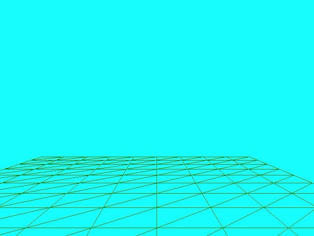

# Assignment - Plane Subdivision

> "Subdivision and Levels of Detail of a plane"

# Resources to help

Some additional resources to help you through this lab assignment

| SDL2 related links                                    | Description                       |
| --------------------------------------------------    | --------------------------------- |
| [SDL API Wiki](https://wiki.libsdl.org/APIByCategory) | Useful guide to all things SDL2   |
| [My SDL2 Youtube Playlist](https://www.youtube.com/playlist?list=PLvv0ScY6vfd-p1gSnbQhY7vMe2rng0IL0) | My Guide for using SDL2 in video form.   |
| [Lazy Foo](http://lazyfoo.net/tutorials/SDL/)         | Great page with written tutorials for learning SDL2. Helpful setup tutorials for each platform. |
| [Lazy Foo - Handling Key Presses](https://lazyfoo.net/tutorials/SDL/04_key_presses/index.php) | Useful tutorial for learning how to handle key presses | 

| OpenGL related links                                | Description                       |
| --------------------------------------------------  | --------------------------------- |
| [My OpenGL Youtube Series](https://www.youtube.com/playlist?list=PLvv0ScY6vfd9zlZkIIqGDeG5TUWswkMox) | My video series for learning OpenGL |
| [docs.gl](http://docs.gl)                           | Excellent documentation to search for OpenGL commands with examples and description of function parameters   |
| [learnopengl.com](https://learnopengl.com)          | OpenGL 3.3+ related tutorial and main free written resource for the course   |

| C++ related links                                   | Description                       |
| --------------------------------------------------  | --------------------------------- |
| [My C++ Youtube Series](https://www.youtube.com/playlist?list=PLvv0ScY6vfd8j-tlhYVPYgiIyXduu6m-L) | My video series playlist for learning C++ |
| [cppreference](https://en.cppreference.com/w/)      | Definitive, more encyclopedic guide to C++ (less beginner focused, but excellent technically) |
| [cplusplus.com](http://www.cplusplus.com)           | Nice website with examples and tutorials geared more for beginners, reference has lots of examples, and the tutorial page is a great starting point |
| [learncpp.com](https://www.learncpp.com/)           | Handy page for learning C++ in tutorial form   |

# Description

For this portion of the assignment, you are going to learn how to algorithmically (procedural geometry) produce the data that you need for a plane at different resolutions. You will also learn how to 'update' data in OpenGL buffers. This is useful for a powerful techniques where you can adaptively change the levels of detail of a model.

## Part 1 - Rendering a plane algorithm

The basic idea is that you will:

1. Render a grid of vertices
2. Connect those vertices together to form triangles.

I've provided some skeleton code -- but you may rip up the current source code and use your own abstraction if you like.

### Task 2 - Interactive graphics

For task 2, we are going to utilize SDL to make our graphics application interactive. 

The tasks for interactivity in this assignment are the following:

- Pressing the <kbd>1</kbd> key draws your object in wireframe mode (By default when you start the application it will show the model in filled).
- Pressing the <kbd>esc</kbd> key exits the application.
- Pressing the <kbd>w</kbd> and <kbd>s</kbd> key move your camera forward and backwrds
- Pressing the <kbd>up</kbd> and <kbd>down</kbd> arrow keys increase and decrease your objects 'resolution' (i.e. the subdivision)

A resource for performing [keyboard input with SDL is provided here](http://lazyfoo.net/tutorials/SDL/04_key_presses/index.php)

### Assignment strategy

Some tips:

- Start slowly and just try to manually draw a plane.
- Then think about how to generate the floating point data.
- Make sure to add color to your vertices, so that when you render in your fragment shader you can see a color that contrasts against the background.
- Use the wireframe mode to debug your geometry.

## How to compile and run your program

1. Your solution should compile using the [build.py](./build.py) file. 
	- That is, we will run your program by typing [python3 build.py](./build.py) and it should just work.

# Submission/Deliverables

### Submission

- Commit all of your files to github, including any additional files you create.
- Do not commit any binary files unless told to do so.
- Do not commit any 'data' files generated when executing a binary.

### Deliverables

- Your solution should be interactive, and utilize the keypresses as described in Task 2

* You need to commit your code to this repository.
* You need to use the build.py script provided. Anything else used is at your own risk--and you should provide complete documentation. If your program does not compile and run, you get a zero!

# F.A.Q. (Instructor Anticipated Questions)

* Q: Can I use another shape?
  * A: For now, please just use planes. If you want to add functionality for spheres or some other primitive, go for it.
* Q: Can I use a triangle strip instead?
  * A: Sure -- we'll cover those later on in the semester.
* Q: Can I split things into different files?
  * A: Yes -- please do.
  * From a teaching and learning standpoint it makes sense for me to have everything in one file. It's probably faster for you to grep as well. From my engineering brain it's a little painful to not use some abstraction and introspection capabilities in the language -- but that is a difficulty in teaching graphics. There's also another engineering argument that the simplest thing possible is what the hardware has a chance to optimize. Anyway, don't get too fancy, but try some things out if you think they'll help you.

# Found a bug?

If you found a mistake (big or small, including spelling mistakes) in this lab, kindly send me an e-mail. It is not seen as nitpicky, but appreciated! (Or rather, future generations of students will appreciate it!)

- Fun fact: The famous computer scientist Donald Knuth would pay folks one $2.56 for errors in his published works. [[source](https://en.wikipedia.org/wiki/Knuth_reward_check)]
- Unfortunately, there is no monetary reward in this course :)
